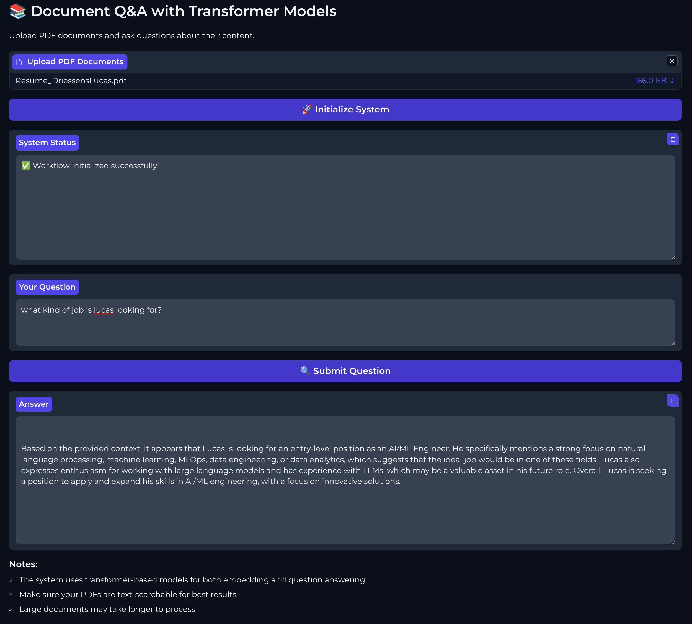

# 📚 Document Q&A with Transformer Models

This project allows you to upload PDF documents and ask questions about their content using transformer models. 

## Features
- **Document Upload**: Easily upload multiple PDF files for processing.
- **Interactive Q&A**: Ask questions and receive answers based on the content of the uploaded documents.

### Note
- The LLM is very chatty and may provide verbose answers. Be prepared for detailed responses to your queries.
- Ensure your PDFs are text-searchable for best results.
- Large documents may take longer to process.

## Features

- Upload multiple PDF documents.
- Ask questions about the content of the uploaded documents.
- Utilizes state-of-the-art transformer models for efficient question answering.
- Real-time responses through an intuitive Gradio interface.

### Demo



## Requirements

Ensure you have the following packages installed:

- Python 3.8 or later
- Gradio
- LangChain
- Hugging Face Transformers
- FAISS (Facebook AI Similarity Search)

## Installation

1. Clone the repository:

   ```bash
   git clone <repository-url>
   cd <repository-directory>
   ```

2. Install the required packages:

   ```bash
   conda env create -f environment.yml
   ```

## Usage

1. Run the application:

   ```bash
   python app.py
   ```

2. Access the Gradio interface at `http://localhost:7860`.

3. Upload your PDF documents using the provided file upload button.

4. Click "🚀 Initialize System" to prepare the documents for querying.

5. Enter your question in the "Your Question" textbox and click "🔍 Submit Question" to receive an answer.

## Workflow Description

1. **Upload Documents**: Users can upload one or more PDF files.
2. **Initialize System**: The application processes the uploaded PDFs, extracting their content and preparing it for querying.
3. **Query Processing**: Users can submit questions about the documents, and the system utilizes a transformer model to provide answers based on the content.

### Key Components:

- **Document Processing**: PDFs are converted to text, and metadata is extracted for context.
- **Question Answering**: A retriever model is created to fetch relevant information from the documents based on user queries.

## Notes

- Ensure that your PDFs are text-searchable for the best results.
- Large documents may take longer to process.

## License

This project is licensed under the MIT License. See the LICENSE file for details.